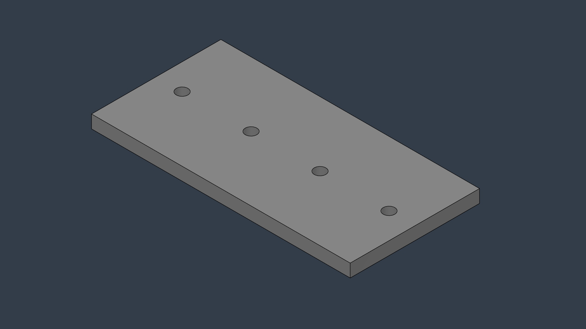
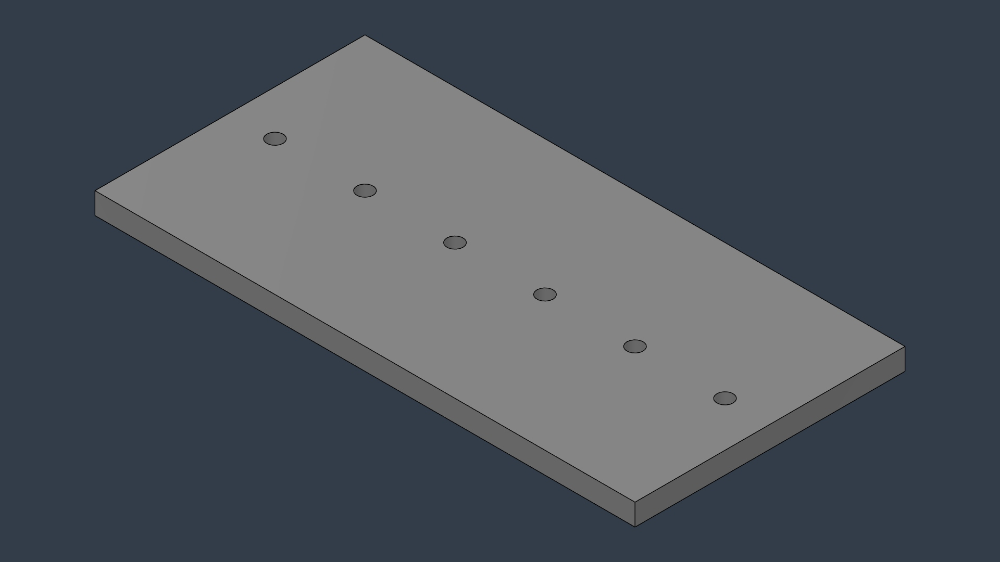
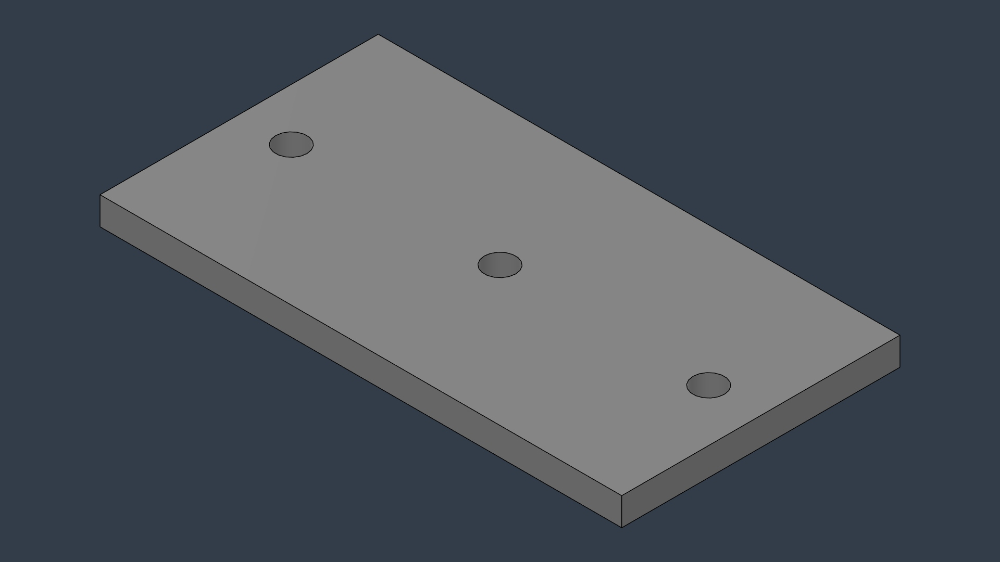
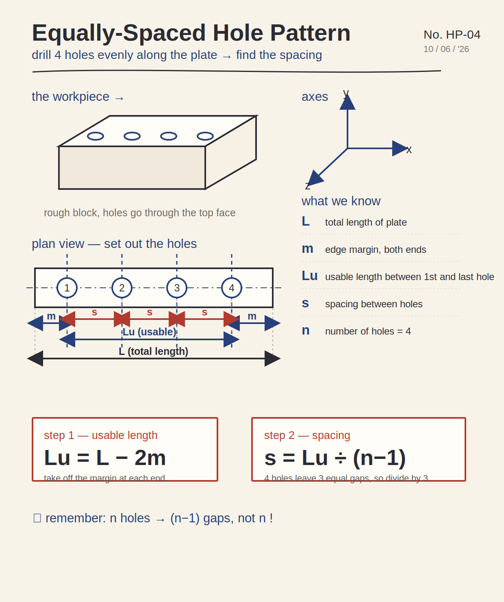

# Parametric Bracket Generator

A [Autodesk Fusion 360](https://www.autodesk.com/products/fusion-360) script that generates mounting plates with evenly-spaced holes directly from a CSV spreadsheet, exporting each part as a manufacturer-ready STEP file. Fill in a row, run once, get a finished part — no manual modeling.

## The problem

Many engineered products are *configurable*: the same basic part repeats in dozens of sizes — different lengths, hole counts, or thicknesses per order. Modeling each variant by hand in CAD is slow and repetitive: open the file, sketch, dimension, drill holes, export STEP, repeat. A few minutes per part adds up fast, and it's exactly the kind of work that's easy to get wrong by hand and easy to automate with code.

This script collapses that loop. The dimensions live in a spreadsheet; the script does the modeling.

## What it does

Given a CSV where each row describes a plate, the script:

1. Builds a rectangular plate to the given length, width, and thickness.
2. Drills *N* holes, evenly spaced along the plate with a margin at each end.
3. Exports the result as a STEP file named after the row.

One run over a spreadsheet of 20 plates produces 20 STEP files.

## Demo

Three parts generated from a single CSV in one run — same script, different rows:

| bracket_A | bracket_B | bracket_C |
|:--:|:--:|:--:|
|  |  |  |
| 200 × 100 × 10 mm — 4 holes | 300 × 150 × 12 mm — 6 holes | 150 × 80 × 8 mm — 3 holes |

Each plate has the correct hole count and even spacing straight from its spreadsheet row.

## Design logic

Before writing any code, I worked out the hole-spacing geometry by hand:



The key insight is the "fence-post" relationship: **N holes create N − 1 gaps between them** (four posts, three sections of fence). Getting this wrong is the classic off-by-one that pushes holes toward one end.

The math, straight from the sketch:

```
usable length = total length − 2 × margin
spacing       = usable length / (number of holes − 1)
```

Each hole then sits at `margin + i × spacing` for `i` from 0 to N − 1, centered on the plate's width. That's the entire positioning logic, and it translates directly into the loop in the code.

## How it works

The script is split into two parts, a pattern that keeps it clean and extensible:

- **`build_plate(...)`** — the *worker*. Takes a single set of dimensions and produces one finished, hole-drilled, exported part. It knows nothing about spreadsheets.
- **`run(...)`** — the *manager*. Reads the CSV row by row and calls the worker once per row, handing it that row's dimensions and output path.

This separation means the building logic is written once and reused for every part. Adding a new part is a new line in a CSV, not new code.

Each build follows the core Fusion modeling pattern — **sketch → profile → feature** — twice: once to extrude the plate body, once to cut the holes through it.

## Units

The CSV is written in **millimeters** for human readability. Fusion's API works internally in centimeters, so the script divides each value by 10 on the way in. A `200` in the spreadsheet produces a 200 mm plate.

## Tech stack

- **Python** — Fusion 360's scripting language
- **Fusion 360 API** (`adsk.core`, `adsk.fusion`) — programmatic CAD modeling and STEP export
- **`csv`** (standard library) — reads the part specifications (no external dependencies; pandas is not available in Fusion's bundled Python)

## Usage

**Prerequisites:** Autodesk Fusion 360 installed.

1. Place `parts.csv` somewhere accessible and update `csv_path` in the script to point to it. Adjust the export directory if needed.
2. In Fusion: **Utilities → Scripts and Add-Ins → +** to add the script, then **Edit** to paste in `bracket_generator.py`.
3. Run it from the Scripts and Add-Ins dialog.
4. Find the generated STEP files in your chosen export folder.

**CSV format:**

```csv
name,length,width,thickness,num_holes,hole_radius,margin
bracket_A,200,100,10,4,4.5,20
bracket_B,300,150,12,6,4.5,25
bracket_C,150,80,8,3,4.5,15
```

All dimensions in millimeters; `hole_radius` is the radius of each drilled hole.

## Example output

The `output/` folder contains the three STEP files produced from the sample `parts.csv`. They open in any CAD package, so you can inspect the generated geometry without running the script.

## Possible extensions

- L-shaped and folded brackets (sheet-metal features)
- 2D hole grids and bolt-circle patterns
- Auto-generated 2D drawings (PDF) alongside each STEP
- A bill-of-materials summary across the batch
- An in-app input dialog for one-off parts

## Why I built this

I'm a mechanical engineer exploring the overlap between CAD and software — automating the repetitive parts of design work rather than doing them by hand. This project is a small, end-to-end example of that: design intent worked out on paper, then turned into a tool that produces real, manufacturable output from a spreadsheet.